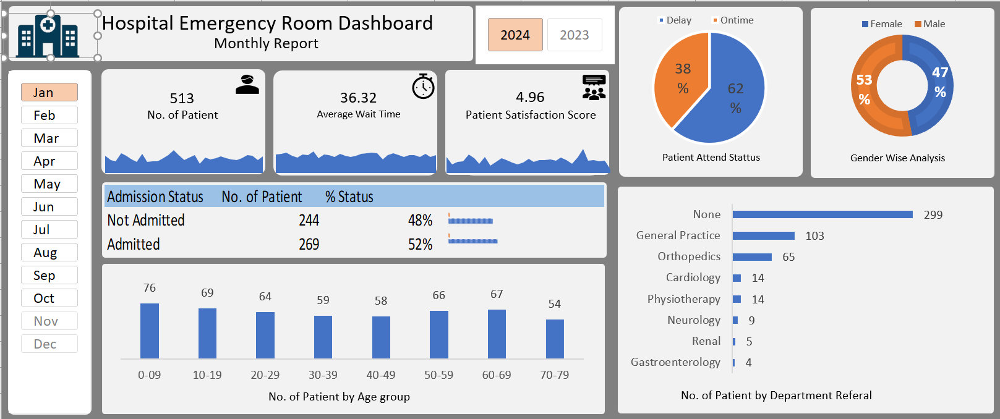

# 🏥 Hospital Emergency Room Dashboard

> An end-to-end data analytics project built in Microsoft Excel — covering data cleaning, analysis, and an interactive monthly dashboard for a hospital emergency room.

---

## 📊 Project Overview

This project demonstrates a complete data analytics workflow using real-world hospital emergency room data. The goal is to transform raw patient data into an interactive Excel dashboard that helps hospital management monitor key performance indicators (KPIs) on a monthly basis.

---

## 🖼️ Dashboard Preview



---

## 📁 Project Structure

```
Hospital-ER-Dashboard/
│
├── Hospital_Emergency_Room_Data.csv        # Raw source data
├── End_to_End_Dashboard_Project2.xlsx      # Excel workbook (cleaned data + dashboard)
├── END_TO_END_DASHBOARD_PROJECT_IN_EXCEL.pptx  # Project presentation/walkthrough
├── Final_Dashboard_of_Hospital_emergency_room.png  # Dashboard screenshot
├── Hospital_Logo.png                       # Hospital logo asset
└── README.md                               # Project documentation
```

---

## 📌 Key Features

- ✅ **Monthly Interactive Dashboard** — Filter data by month (Jan–Dec) and year (2023/2024)
- ✅ **KPI Cards** — Total Patients, Average Wait Time, Patient Satisfaction Score
- ✅ **Patient Attend Status** — Pie chart showing On-Time vs Delayed arrivals (62% vs 38%)
- ✅ **Gender-Wise Analysis** — Donut chart (Female 53% / Male 47%)
- ✅ **Admission Status Table** — Admitted vs Not Admitted counts and percentages
- ✅ **Age Group Analysis** — Bar chart showing patient distribution across age groups (0–79)
- ✅ **Department Referral Analysis** — Horizontal bar chart for all referring departments

---

## 📈 Dashboard KPIs (Sample — January 2024)

| Metric | Value |
|---|---|
| Total Patients | 513 |
| Average Wait Time | 36.32 minutes |
| Patient Satisfaction Score | 4.96 / 10 |
| Admitted | 269 (52%) |
| Not Admitted | 244 (48%) |
| On-Time Arrivals | 62% |
| Delayed Arrivals | 38% |

---

## 🏥 Department Referral Breakdown (Jan 2024)

| Department | Patients |
|---|---|
| None (Walk-in) | 299 |
| General Practice | 103 |
| Orthopedics | 65 |
| Cardiology | 14 |
| Physiotherapy | 14 |
| Neurology | 9 |
| Renal | 5 |
| Gastroenterology | 4 |

---

## 🛠️ Tools & Technologies

| Tool | Purpose |
|---|---|
| **Microsoft Excel** | Data cleaning, pivot tables, charts, dashboard design |
| **CSV (Raw Data)** | Source data for the project |
| **PowerPoint** | Project walkthrough and presentation |

---

## 🔄 Project Workflow

```
Raw CSV Data
    ↓
Data Cleaning & Preprocessing (Excel)
    ↓
Data Analysis (Pivot Tables & Formulas)
    ↓
Chart Creation (Bar, Pie, Donut, Sparklines)
    ↓
Dashboard Design & Interactivity (Slicers / Buttons)
    ↓
Final Dashboard (Monthly Report)
```

---

## 📂 Data Description

The raw dataset (`Hospital_Emergency_Room_Data.csv`) contains emergency room patient records with the following key fields:

- **Patient ID** — Unique identifier for each patient
- **Date & Time** — Visit date and time
- **Age** — Patient age (grouped: 0–9, 10–19, ..., 70–79)
- **Gender** — Male / Female
- **Wait Time** — Time (in minutes) before being seen
- **Satisfaction Score** — Patient-rated score
- **Admission Status** — Admitted / Not Admitted
- **Department Referral** — Referring department (e.g., Cardiology, Orthopedics)
- **Attend Status** — On-Time / Delayed

---

## 🚀 How to Use

1. **Clone this repository**
   ```bash
   git clone https://github.com/your-username/hospital-er-dashboard.git
   ```

2. **Open the Excel file**
   ```
   End_to_End_Dashboard_Project2.xlsx
   ```

3. **Navigate to the Dashboard sheet**

4. **Use the Month buttons** (Jan–Dec) and **Year toggle** (2024/2023) to filter the data interactively

---

## 📚 Learning Outcomes

- End-to-end data analytics project lifecycle
- Data cleaning and transformation in Excel
- Building KPI cards with sparklines
- Creating interactive dashboards with slicers and form controls
- Storytelling with data through effective chart selection

---

## 👤 Author

**[Your Name]**  
Data Analytics Project | Excel Dashboard  
📧 your.email@example.com  
🔗 [LinkedIn](https://linkedin.com/in/your-profile) | [GitHub](https://github.com/your-username)

---

## 📄 License

This project is for educational and portfolio purposes.

---

> ⭐ If you found this project helpful, please give it a star on GitHub!
